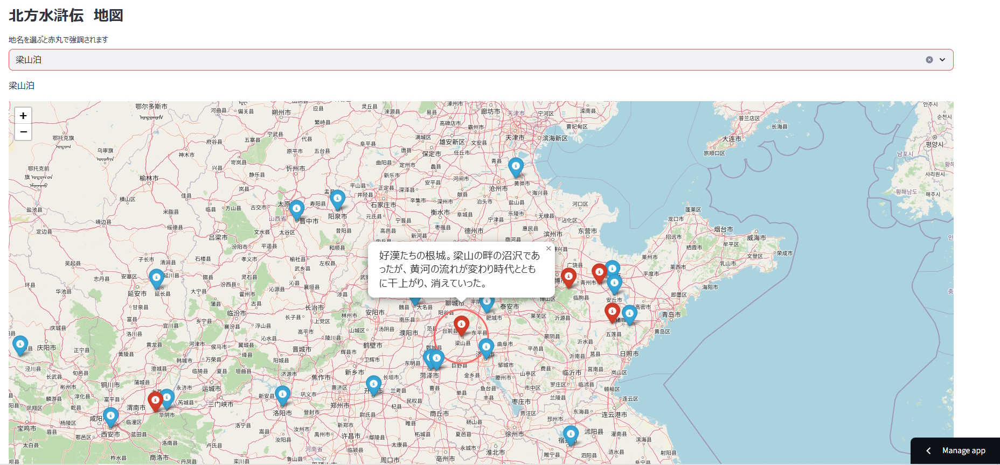

# 北方水滸伝地図
自分が原作を読んでて、今どの辺りで話が進んでるのか知りたいなあって思ったので作っている、趣味全開のアプリです。  
随時更新してます。出来れば岳飛伝まで行きたいけど気分次第。  
Streamlitへデプロイしています。     
[リンク](https://kitakatasuikomap-ajrp3msyidm2tkvnalqljy.streamlit.app/)

## スクリーンショット

  

## その他
座標は地図と小説を見比べながらそれらしいところを入力していますが、たぶん限界があります。    
あくまで目安として見てください。    
二竜山周りとか小説の地図と一致しない・・・